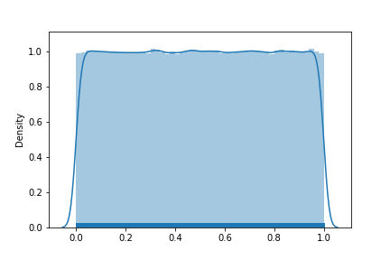

# Pseudorandom number

<center>SID: 12011517<center>

<center>Name: 李子南<center>
## History of pseudorandom number

### Manually Generated Random Number

​	Random numbers are sequences with randomness. Randomness is the characteristic of unpredictable things. Like a dice with four sides, the result of each roll of dice is one of these four sides, but it is unpredictable. The earliest dice found comes from a tomb in the Middle East in the 24th century BC. More recently, in China in 1100 BC, some "prophets" made judgments about the future based on the random cracking phenomenon caused by burning turtle shells. Over the next few centuries, the I Ching divination method was born in China. The 49 yarrow method was used for divination. The splitting process of its operation was very similar to coin tossing.

​	However, modern experiments need a large number of random numbers for simulation. The use of dice and other manual methods can generate real random numbers, but this method is inefficient, needs a lot of time, and cannot be widely used.	

### Machine Generated Random Number

​	In the mid-1940s, Rand Company invented a machine that can generate a large number of random numbers through a random pulse generator. They aggregated the numbers generated by the operation of the machine and published the book "a million random digits with 100000 normal deviates". At the same time, there is also a well-known random number generator, the lottery machine. The predecessor of the lottery machine was invented by the famous Bletchley Park WWII decoding team in the 1940s. At that time, it was used to generate random numbers used in the British insurance bond lottery. 

​	In 1951, randomness was formally normalized and integrated into the computer Ferranti mark 1. Ferranti mark 1 has built-in random number generation instruction, which can generate 20 random bits at one time by using electrical noise. This feature was designed by Alan Turing. Christopher Strachey used this feature to write a set of random love letter generators.

​	However, Turing's random number instruction was almost collapsed by the developers at that time, because this kind of randomness introduced uncertainty in the already unstable development environment. People hope to get consistent results in software, but software with such instructions can never get repeatable consistent results, which makes software testing almost impossible.

​	Hence, pseudo-random number generator (PRNG) is invented, which replace the random number generator by a deterministic function. By giving a certain initial condition, the same random sequence can be generated repeatedly.

### Pseudo-random Number

​	Difference from the properties of true number ---- randomness (no statistical deviation) unpredictability (no correlation with past numbers); non reproducibility, pseudo-random number is computer-generated random numbers follow certain laws, such as distribution probability. The random function in the computer is simulated according to a certain algorithm, and the result is definite and visible. Therefore, the "random number" generated by computer random function is not random, but pseudo-random number.

​	Because the pseudo-random number is generated by machine, it is not a physical process in nature. Although its period is very long, it is still regular and predictable in theory. Some "good doers" use some method to generate a large number of true random numbers and pseudo-random numbers respectively, and visualize these random numbers, as shown in the following figure: 

​															

​							<font size = 1>Figure 1 True Random Numbers	</font>							<font size = 1>Figure 2 Pseudo-random numbers</font>

​	The above two figures are true random numbers and pseudo-random numbers respectively. From an intuitive point of view, true random numbers do not have any rules, while pseudo-random numbers do arrange with certain rules

### Pseudo-random Number Generator

​	The first pseudo-random number generator was created by von Neumann in 1946. The basic idea is to start with a random number seed, square it, and then take the middle value. Next, repeat the process of squaring the obtained number and taking the intermediate value. Then, a random number sequence with statistical significance is generated. This is the well-known square middle method. However, von Neumann's method was overthrown by later generations, because no matter what random seed you start with, the sequence will eventually fall into a short cycle sequence, such as 810061004100

​	In 1949, mathematician d.h.lehmer overcame the defect of square middle method by using Linear Congruence Generator (LCG). But later, people put forward higher requirements for PRNG, which is not only limited by generating algorithm but also the performance of CPU. Therefore, in the mid-1990s, the world entered a period of fanatical innovation of random number generators, and various random number generators emerged in endlessly. One of the most famous is lavaland, invented by a team from SGI, which uses a webcam to take photos of lava lights. The picture data from the camera is a real entropy source, that is, a real random number generator, and can generate random numbers at a rate of 165kb/s.

​	At the same time, a software called the Mersenne twister, stands out among many PRNG. It was invented by Matsumoto and Nishimura Toshi in 1997. It perfectly balances performance with the quality of random numbers, and is still a good method today. Its basic idea is based on the linear feedback displacement register, which can generate a deterministic sequence with a very long cycle period.

​	In the 21st century, password security is receiving more and more attention, and the parallel "password security PRNG" is also developing rapidly. The speed of various pseudo-random number generators is accelerating, and the cycle period is also increasing. Although many pseudo-random number generators have been questioned, so far, people cannot get rid of the dependence on these efficient pseudo-random number generators.


## Methods and principles of generating pseudo random numbers

### LCG method

​	The LCG method is defined as $X_{n+1} = (aX_n + c)\ mod\ m \ \ (n \geq 0)$
$$
	m, & \text{the modulus,} & 0 < m \\
	a, & \text{the multiplier,} & 0 \leq a< m \\
	c, & \text{the increment,} & 0 \leq c < m \\
	X_0, & \text{the starting value,} & 0 \leq X_0 < m
$$
​	If c = 0, then it's called Multiplicative Congruential Generator. If c != 0, it's called Mixed Linear Congruential Generator. $X_0$ is the starting value, or the so-called seed. **The linear congruence sequence that LCG method generate must have a period P**, the prove is shown below:

​	Set $X_{n+1} = f(X_n)$, this function is self-enclosed. And for every $x_n$ in sequence and every $f(x_n)$, we have $x_n \in [0,m-1], f(x_n) \in[0,m-1]$. 

​	Assume that we have two sets: S and T. Initially, S include every integer from 0 to m-1, T is an empty set.
$$
S = \{0,1,...,m-1\} & |S| = m\\
T = \emptyset & |T| = 0
$$
​	At the beginning, we have $X_1 = f(X_0)$, $X_1$ must in set $S$. We move $X_1$ from $S$ to $T$ 
$$
S = \{0,1,...,m-1\} & |S| = m-1\\
T = \{X_1\} & |T| =1
$$
​	If $X_2 = f(X_1) \in T$, then a period P = 1 is generated. If $X_2 = f(X_1) \in S$, then continue the process.

​	If $X_{n+1} = f(X_n) \in T$, then a period P $\leq$ n is generated. At the end the of the process, the set S may become a emptyset, therefore $X_m = f(X_{m-1}) \in T$, the max value of P is m.

​	Therefore $f$ must have a period $0<P\leq m$

​	In order to produce a longer period, the choice of modulus and multiplier is very important. Modulus should be as large as possible. According to ***TAOCP*** (The Art of Computer Programming),  if a word in computer is $w$ bit, the modulus should be $2^w$ or $2^{w}-1$ or $2^w + 1$. But when $m = 2^w$ the low bits of the number do not have good randomness. The multiplier should be chosen to make the period of sequence as long as possible. In ***TAOCP*** the the theorem below is proved:

The linear congruential sequence defined by m, a, c and $X_0$ **has period length m** if and only if

1.  c is relatively prime to m;
2.  b = a - 1 is a multiple of p, for every prime p dividing m;
3.  b is a multiple of 4, if m is a multiple of 4

Conclusion:

1.  Modulus should be as large as possible, usually use $2^w$ or $2^w +1$ or $2^w-1$
2.  If $m = 2^w$, then a should be $a \equiv 5(mod\ 8)$
3.  c should be relatively prime to m
4.  Seed should be random number, usually use time stamp


## Implementation of pseudorandom number in C source code

​	To get a better understanding of the code implementation of the LCG method, I think read the source code of the implementation of rand() in C++ is necessary.

The source code is shown below:

```C++
int rand (){
  return (int) __random ();
}

long int __random (){
  int32_t retval;
  __libc_lock_lock (lock);
  (void) __random_r (&unsafe_state, &retval);
  __libc_lock_unlock (lock);
  return retval;
}
int __random_r (buf, result)
     struct random_data *buf;
     int32_t *result;
{
  int32_t *state;
  if (buf == NULL || result == NULL)
    goto fail;

  state = buf->state;
  if (buf->rand_type == TYPE_0){
      int32_t val = state[0];
      val = ((state[0] * 1103515245) + 12345) & 0x7fffffff;
      state[0] = val;
      *result = val;
    }else{
      int32_t *fptr = buf->fptr;
      int32_t *rptr = buf->rptr;
      int32_t *end_ptr = buf->end_ptr;
      int32_t val;
      val = *fptr += *rptr;
      /* Chucking least random bit.  */
      *result = (val >> 1) & 0x7fffffff;
      ++fptr;
      if (fptr >= end_ptr){
      fptr = state;
      ++rptr;
    }else{
      ++rptr;
      if (rptr >= end_ptr)
        rptr = state;
    }
      buf->fptr = fptr;
      buf->rptr = rptr;
    }
  return 0;
 
 fail:
  __set_errno (EINVAL);
  return -1;
}
```

​	As we can see, the source code of c++ use the LCG algorithm to generate random number, and the imput buf is the seed, rand() will pick a default number and change it every time when it is called. Inorder to keep the data safe, it is protected by lock to prevent two threads get the same value. In the function m = $2^{31}$, a = 1103515245, c = 12345. Using Euclidean algorithm, we can find c and m are relatively prime. 1103515245 mod 8 = 5, which satisfy the limitation.

## My implementation(LCG method)

```c++
class Random
{
private:
    int64_t seed;
    int64_t module = (1L << 48) - 1;
    int64_t multiplier = 0x5DEECE66DL;
    int64_t addend = 0xBL;
    int64_t aug = 1181783497276652981L;
    int64_t aug2 = 8682522807148012L;
    double double_unit = 0x1.0p-53;
    long long seedUniquifier();
    //function declare are omitted
};
```

```c++
Random::Random() {
    struct timespec tn;
    seed = (seedUniquifier() ^ clock_gettime(CLOCK_REALTIME, &tn));  // nanotime 10e9
}
Random::Random(int64_t seed) {
    this->seed = seed;
}
int64_t Random::seedUniquifier() {
    return aug * aug2;
}
void Random::setSeed(int64_t seed) {
    this->seed = seed;
}
long long Random::getSeed() {
    return this->seed;
}
int64_t Random::next(int bit = 48) {  // random number in [0, 2^48 - 1]
    this->seed = (this->seed * multiplier + addend) & module;
    return this->seed >> (48 - bit);
}
int Random::nextInt() {
    return this->next(32);
}
int Random::nextInt(int n) {// random number in [0, n)
    return floor(((double)this->next() / module) * n);
}
int64_t Random::nextLong() {
    return (this->next(32) << 32 | this->next(32));
}
float Random::nextFloat() {
    return this->next(24) / ((float)(1 << 24));
}
double Random::nextDouble() {
    return (((long)(this->next(26)) << 27) + this->next(27)) * double_unit;
}
```

​	In my implementation, I write a class to store the seed. I choose a = 0x5DEECE66D, c = 0xBL, m = 5DEECE66DL, which all satisfy the rule above. It can produce pseudo random number max to $2^{48}$.To add randomness, I discard low bits of random number according to the arguments. Because seed/m is approximately a uniform distribution between 0 to 1. Therefore I use `floor(((double)this->next() / module) * n)` to get the next integer in [0,n).  And the nextLong use two 32 bit random number and do the shift and or operation to produce a random Long number.

## Code efficiency analysis

Test code:

```c++
int main() {
    Random r;
    auto start = chrono::steady_clock::now();
    for (size_t i = 0; i < 100000; i++) {
        r.next(0);
    }
    auto end = chrono::steady_clock::now();
    cout << "My implementation run 100000 times: ";
    cout << chrono::duration_cast<chrono::microseconds>(end - start).count() << " ms." << endl;

    start = chrono::steady_clock::now();
    for (size_t i = 0; i < 100000; i++) {
        rand();
    }
    end = chrono::steady_clock::now();
    cout << "c++ rand() run 100000 times: ";
    cout << chrono::duration_cast<chrono::microseconds>(end - start).count() << " ms." << endl;
    return 0;
}
```

Result:


From running time we can see my code is more efficient than the ran() method. I think it's the result of the lock in rand() make it slower.

And I use python to fit the distribution of 1,000,000 result of two functions, the code and image is shown below:

```C++
int main() {
    Random r;
    ofstream p;
    p.open("output_rand.csv",ios::out|ios::trunc);
    p << "X" << "," << "Y" << endl;
    for (int i = 0; i < 1000000; i++) {
        p << ((double) rand() / (RAND_MAX)) << "," << ((double) rand() / (RAND_MAX)) << endl;
    }
    p.close();

    p.open("output_Random.csv",ios::out|ios::trunc);
    p << "X" << "," << "Y" << endl;
    for (int i = 0; i < 1000000; i++){
        p << ((double)r.next(48) / r.getModule()) << "," << ((double)r.next(48) / r.getModule()) << endl;
    }
    p.close();
    return 0;
}
```

```python
import pandas as pd
import numpy as np
import matplotlib.pyplot as plt
import seaborn as sns

f_rand = pd.read_csv('output_rand.csv')
f_Rand = pd.read_csv('output_Random.csv')
list_rand_X = np.array(f_rand['X'])
list_rand_Y = np.array(f_rand['Y'])
list_Rand_X = np.array(f_Rand['X'])
list_Rand_Y = np.array(f_Rand['Y'])

sns.distplot(list_rand_X, rug=True)
plt.savefig('rand.png')

sns.distplot(list_Rand_X, rug=True)
plt.savefig('Random.png')
```

​					

​							<font size = 1>Distribution of rand()</font>												<font size = 1>Distribution of Random.next()</font>

From the image we can see the distribution of two function both close to uniform distribution.

## The application of pseudo number  

I write few small programs to test my Random class

Here is a function that tell you what to eat:

```C++
int main() {
    for (size_t i = 0; i < 10; i++) {
        cout << what_jiaran_eat_today() << endl;
    }
    return 0;
}
char* what_jiaran_eat_today() {
    static Random r;
    switch (r.nextInt(10)) {
        case 0:
            return "fried chicken";
            break;
        case 1:
            return "humberger";
            break;
        case 2:
            return "pizza";
            break;
        case 3:
            return "sushi";
            break;
        case 4:
            return "steak";
            break;
        case 5:
            return "roast beef";
            break;
        case 6:
            return "noodles";
            break;
        case 7:
            return "hot pot";
            break;
        case 8:
            return "oat meal";
            break;
        case 9:
            return "too fat to eat :(";
            break;
        default:
            break;
    }
}
```

Running result:

