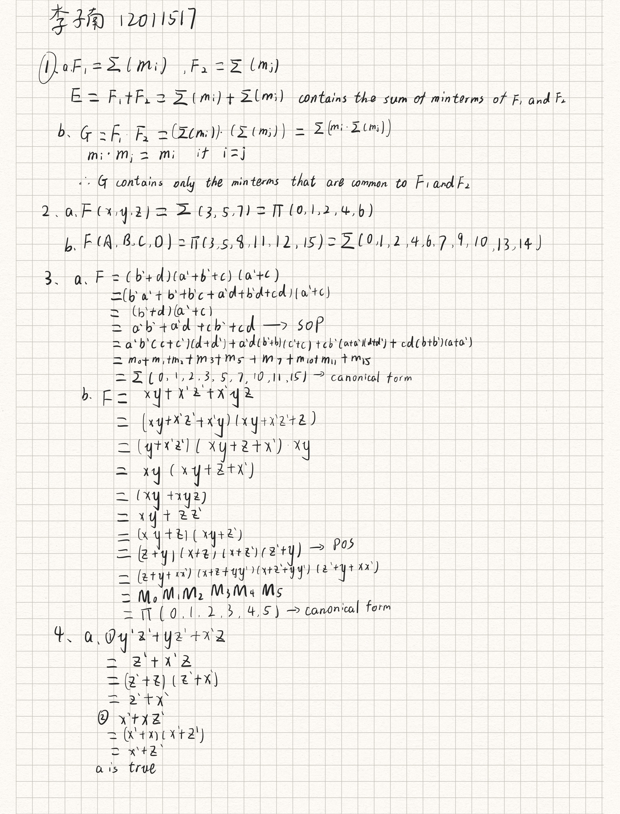
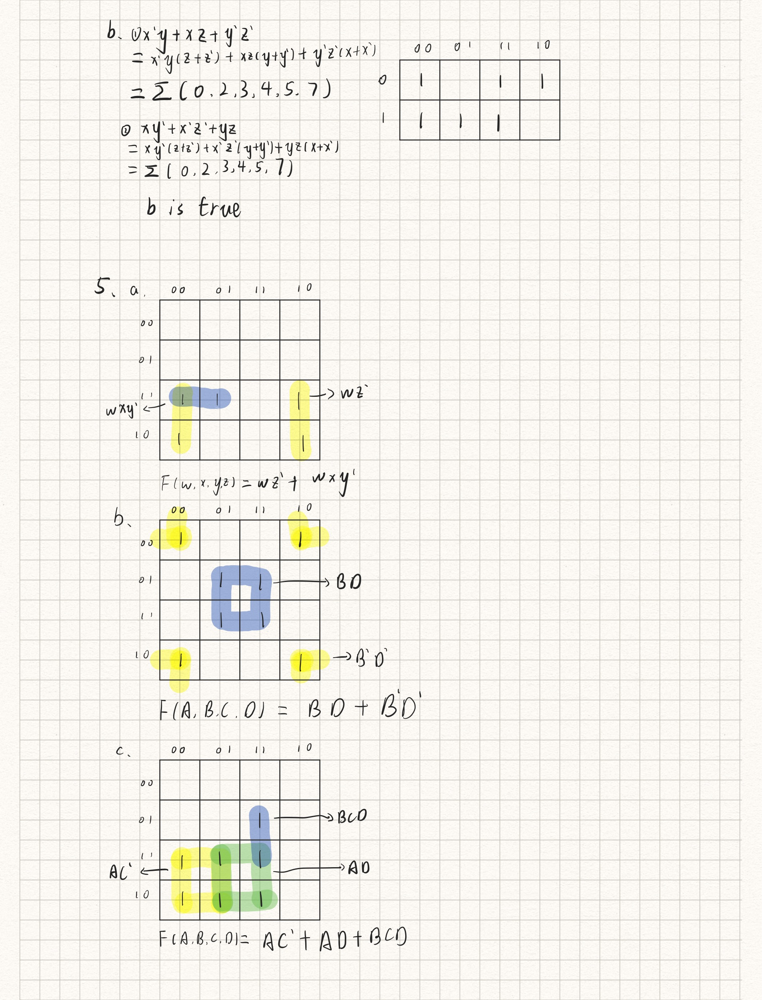
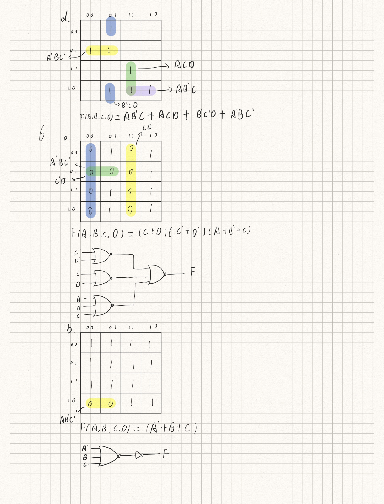
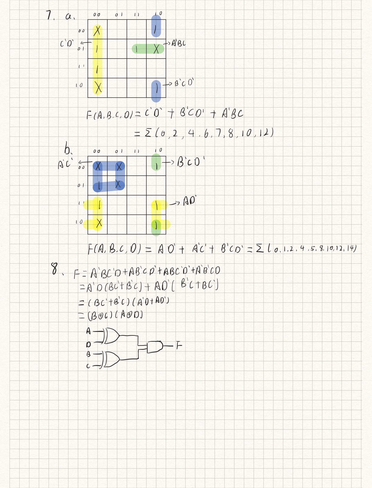
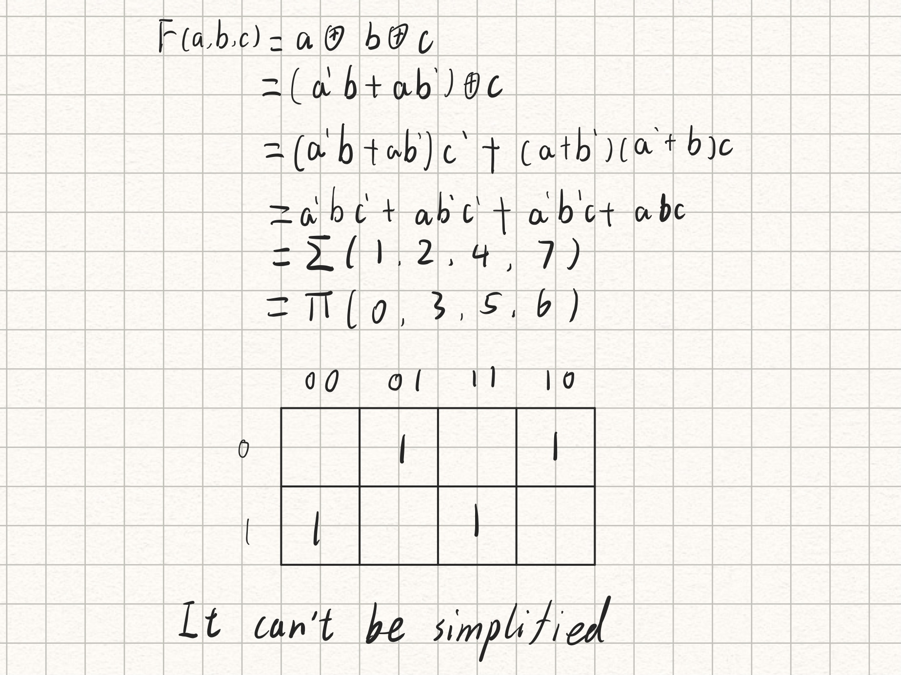
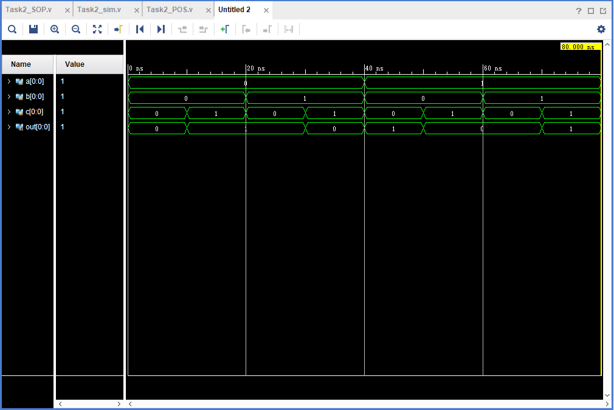

# DIGITAL DESIGN ASSIGNMENT REPORT


**Assignment ID: **2

**Student Name:**李子南

**Student ID:**12011517


## PART 1: DIGITAL DESIGN THEORY 









## PART 2: DIGITAL DESIGN LAB (TASK 1)

### DESIGN

```verilog
module seg(
input  a, b, c, d, e,
output reg [7:0] seg_out,
output reg[7:0]seg_en
    );
 always @*
 begin
     case (e)
             1'b0: 
                 casex({a,b,c,d})
                     4'b1xxx:begin
                         seg_en=8'b1111_1110;
                         seg_out=8'b0100_0000;
                         end // 0
                     4'b01xx:begin
                         seg_en=8'b1111_1110;
                         seg_out=8'b0111_1001;
                         end  // 1
                     4'b001x:begin
                         seg_en=8'b1111_1110;
                         seg_out=8'b0010_0100;
                         end  // 2
                     4'b0001: begin
                         seg_en=8'b1111_1110;
                         seg_out=8'b0011_0000;
                         end  // 3
                     default: seg_en=8'b1111_1111;
                 endcase
             1'b1:
                 casex({a,b,c,d})
                     4'bxxx1: begin
                         seg_en=8'b1111_1110;
                         seg_out=8'b0011_0000;
                         end  // 3
                     4'bxx10:begin
                         seg_en=8'b1111_1110;
                         seg_out=8'b0010_0100;
                         end  // 2
                     4'bx100:begin
                         seg_en=8'b1111_1110;
                         seg_out=8'b0111_1001;
                         end  // 1
                     4'b1000:begin
                         seg_en=8'b1111_1110;
                         seg_out=8'b0100_0000;
                         end // 0
                     default: seg_en=8'b1111_1111;
                 endcase
     endcase
 end
    
endmodule
```


### CONSTRAINT FILE AND TESTING

```verilog
set_property IOSTANDARD LVCMOS33 [get_ports {seg_en[0]}]
set_property IOSTANDARD LVCMOS33 [get_ports {seg_en[1]}]
set_property IOSTANDARD LVCMOS33 [get_ports {seg_en[2]}]
set_property IOSTANDARD LVCMOS33 [get_ports {seg_en[3]}]
set_property IOSTANDARD LVCMOS33 [get_ports {seg_en[4]}]
set_property IOSTANDARD LVCMOS33 [get_ports {seg_en[5]}]
set_property IOSTANDARD LVCMOS33 [get_ports {seg_en[6]}]
set_property IOSTANDARD LVCMOS33 [get_ports {seg_en[7]}]
set_property IOSTANDARD LVCMOS33 [get_ports {seg_out[0]}]
set_property IOSTANDARD LVCMOS33 [get_ports {seg_out[1]}]
set_property IOSTANDARD LVCMOS33 [get_ports {seg_out[2]}]
set_property IOSTANDARD LVCMOS33 [get_ports {seg_out[3]}]
set_property IOSTANDARD LVCMOS33 [get_ports {seg_out[4]}]
set_property IOSTANDARD LVCMOS33 [get_ports {seg_out[5]}]
set_property IOSTANDARD LVCMOS33 [get_ports {seg_out[6]}]
set_property IOSTANDARD LVCMOS33 [get_ports {seg_out[7]}]
set_property IOSTANDARD LVCMOS33 [get_ports {a}]
set_property IOSTANDARD LVCMOS33 [get_ports {b}]
set_property IOSTANDARD LVCMOS33 [get_ports {c}]
set_property IOSTANDARD LVCMOS33 [get_ports {d}]
set_property IOSTANDARD LVCMOS33 [get_ports {e}]
set_property PACKAGE_PIN AB8 [get_ports {e}]
set_property PACKAGE_PIN Y9 [get_ports {a}]
set_property PACKAGE_PIN W9 [get_ports {b}]
set_property PACKAGE_PIN Y7 [get_ports {c}]
set_property PACKAGE_PIN Y8 [get_ports {d}]
set_property PACKAGE_PIN A18 [get_ports {seg_en[7]}]
set_property PACKAGE_PIN A20 [get_ports {seg_en[6]}]
set_property PACKAGE_PIN B20 [get_ports {seg_en[5]}]
set_property PACKAGE_PIN E18 [get_ports {seg_en[4]}]
set_property PACKAGE_PIN F18 [get_ports {seg_en[3]}]
set_property PACKAGE_PIN D19 [get_ports {seg_en[2]}]
set_property PACKAGE_PIN E19 [get_ports {seg_en[1]}]
set_property PACKAGE_PIN C19 [get_ports {seg_en[0]}]
set_property PACKAGE_PIN E13 [get_ports {seg_out[7]}]
set_property PACKAGE_PIN C15 [get_ports {seg_out[6]}]
set_property PACKAGE_PIN C14 [get_ports {seg_out[5]}]
set_property PACKAGE_PIN E17 [get_ports {seg_out[4]}]
set_property PACKAGE_PIN F16 [get_ports {seg_out[3]}]
set_property PACKAGE_PIN F14 [get_ports {seg_out[2]}]
set_property PACKAGE_PIN F13 [get_ports {seg_out[1]}]
set_property PACKAGE_PIN F15 [get_ports {seg_out[0]}]

```

#### Test result

下方按钮从左到右依次代表0号，1号，2号，3号，优先级切换开关

1. 所有开关都为关闭状态，灯不亮。


2. 0号开关打开，显示为0


3. 1，2，3号开关同时打开，优先级开关关闭。按照优先级显示1号病房。


4. 1，2，3号开关同时打开，优先级开关开启。按照优先级显示3号病房。


5. 所有病房开关关闭，优先级开关开启，依然不显示。


### THE DESCRIPTION OF OPERATION

​	一开始我将设计文件中的seg_en改为了1位宽，但无法生成比特流文件，后来再回去翻ppt才搞懂，seg_en应该是8位，亮的灯比特位为1。之后成功生成了比特流文件并烧写进了板子里，但还是不能正常运行，2号和3号病房的开关变成了0和1，后面发现是因为我把程序写在了两个模块中，并且在参数传递的时候出现了问题。之后我将所有代码整合到一个模块里，就可以正常运行了。


## PART 2: DIGITAL DESIGN LAB (TASK 2)



#### Truth-table

| {a,b,c} |  F   |
| :-----: | :--: |
|   000   |  0   |
|   001   |  1   |
|   010   |  1   |
|   011   |  0   |
|   100   |  1   |
|   101   |  0   |
|   110   |  0   |
|   111   |  1   |


### DESIGN

#### SOP

```verilog
module Task2_SOP(
input[0:0] a,b,c,
output[0:0] out
    );
    assign out = (~a & b & ~c) | (a & ~b & ~c) | (a & b & c) | (~a & ~b & c);
endmodule
```

#### POS

```verilog
module Task2_POS(
input[0:0] a,b,c,
output[0:0] out
    );
    assign out = (a | b | c) & (a | ~b | ~c) & (~a | b | ~c) & (~a | ~b | c);
endmodule
```


### SIMULATION

```verilog
module Task2_sim();
reg[0:0] a,b,c;
wire[0:0] out;
  Task2_POS pos(a,b,c,out);//or Task2_SOP sop(a,b,c,out)
initial
    begin
    {a,b,c} = 3'b000;
    while({a,b,c} < 3'b111)begin
            #10 {a,b,c} = {a,b,c} + 1;
        end
    #10 $finish;
    end
endmodule
```




根据真值表，模拟结果正确。

### THE DESCRIPTION OF OPERATION

本题我先是在纸上化简了原式，得到了SOP形式和POS形式，之后写出了设计文件和仿真文件，但我SOP的设计文件第一次写漏了一个最小项，让我疑惑了半个小时，后面发现了就没事了。
