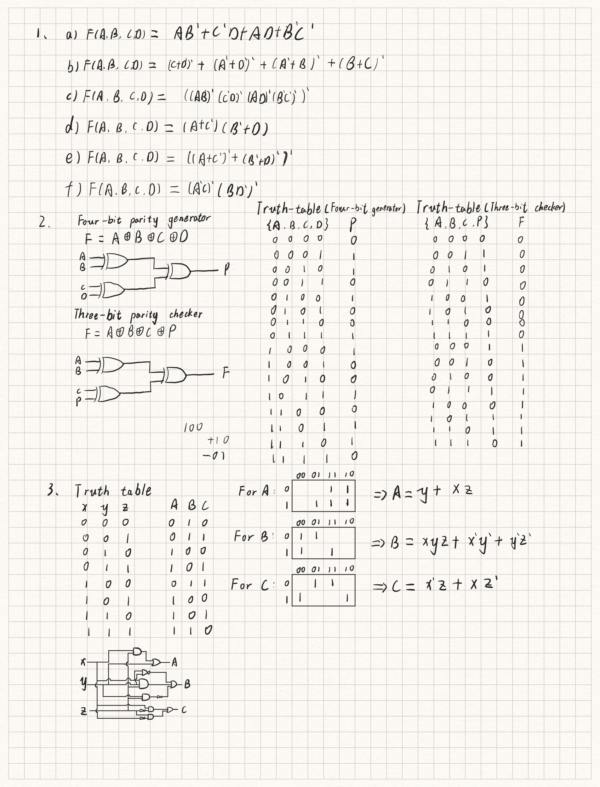
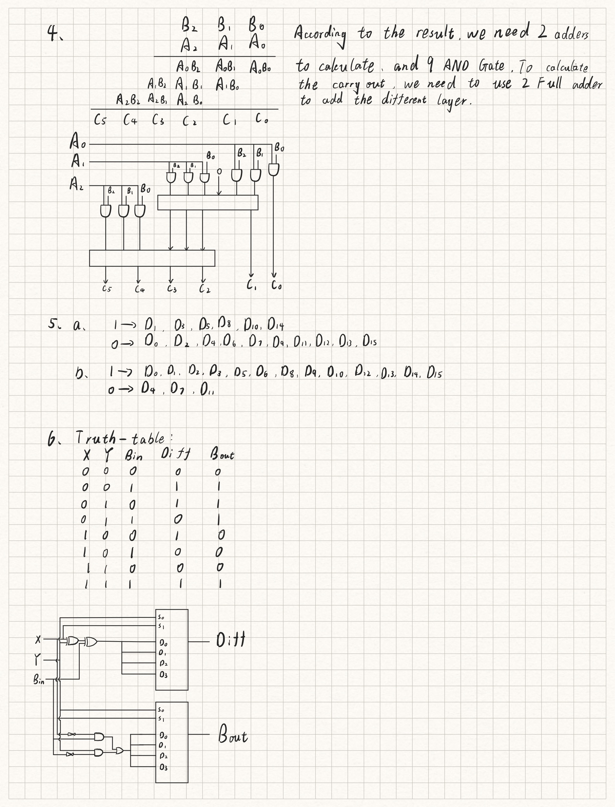
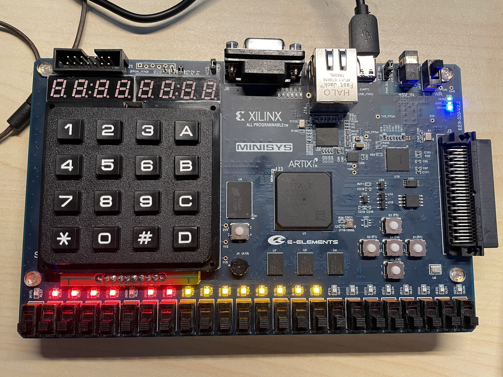

# DIGITAL DESIGN ASSIGNMENT REPORT


**Assignment ID: **3

**Student Name:**李子南

**Student ID:**12011517

## PART 1: DIGITAL DESIGN THEORY 

  



## PART 2: DIGITAL DESIGN LAB

### Task1:

#### 74138

```verilog
module decoder_74138 (
    a,b,c,en1,en2,en3,y0,y1,y2,y3,y4,y5,y6,y7
);
    input a,b,c,en1,en2,en3;
    output reg y0,y1,y2,y3,y4,y5,y6,y7;
    always @(*) begin
        if ({en1,en2,en3} == 3'b100) begin
            case ({a,b,c})
                3'b000: {y0,y1,y2,y3,y4,y5,y6,y7} = 8'b01111111;
                3'b001: {y0,y1,y2,y3,y4,y5,y6,y7} = 8'b10111111;
                3'b010: {y0,y1,y2,y3,y4,y5,y6,y7} = 8'b11011111;
                3'b011: {y0,y1,y2,y3,y4,y5,y6,y7} = 8'b11101111;
                3'b100: {y0,y1,y2,y3,y4,y5,y6,y7} = 8'b11110111;
                3'b101: {y0,y1,y2,y3,y4,y5,y6,y7} = 8'b11111011;
                3'b110: {y0,y1,y2,y3,y4,y5,y6,y7} = 8'b11111101;
                3'b111: {y0,y1,y2,y3,y4,y5,y6,y7} = 8'b11111110;
                default: {y0,y1,y2,y3,y4,y5,y6,y7} = 8'b11111111;
            endcase
        end
        else begin
            {y0,y1,y2,y3,y4,y5,y6,y7} = 8'b11111111;
        end
    end
endmodule
```

#### 4-16

```verilog
module decoder_416 (
  	A,B,C,D,x0,x1,x2,x3,x4,x5,x6,x7,x8,x9,x10,x11,x12,x13,x14,x15
);
  input A,B,C,D;
  output reg x0,x1,x2,x3,x4,x5,x6,x7,x8,x9,x10,x11,x12,x13,x14,x15;
    decoder_74138 decoder(B,C,D,A,1'b0,1'b0,x8,x9,x10,x11,x12,x13,x14,x15);
    decoder_74138 decoder2(B,C,D,~A,1'b0,1'b0,x0,x1,x2,x3,x4,x5,x6,x7);  
endmodule
```

#### Sim74138(Using Iverilog)

```verilog
module top_module ();
    reg [0:0] A,B,C,D,E,F;
    wire [0:0] y0,y1,y2,y3,y4,y5,y6,y7;
    decoder_74138 decoder(A,B,C,D,E,F,y0,y1,y2,y3,y4,y5,y6,y7);
    initial `probe_start;
    `probe(A);
    `probe(B);
    `probe(C);
    `probe(D);
    `probe(E);
    `probe(F);
    `probe(y0);
    `probe(y1);
    `probe(y2);
    `probe(y3);
    `probe(y4);
    `probe(y5);
    `probe(y6);
    `probe(y7);
    initial begin
        {D,E,F,A,B,C} = 6'b000000;
        while ({D,E,F,A,B,C} < 6'b1111111) begin
            #10 {D,E,F,A,B,C} = {D,E,F,A,B,C} + 1;
        end
        #10 $finish;
    end
endmodule
```

#### Result


后面还有一部分都是0，就不放上来了。

#### Sim4-16(Using Iverilog)

```verilog
module top_module ();
    reg [0:0] A,B,C,D,En1,En2,En3;
    wire X0,X1,X2,X3,X4,X5,X6,X7,X8,X9,X10,X11,X12,X13,X14,X15;
    decoder_416 de(A,B,C,D,X0,X1,X2,X3,X4,X5,X6,X7,X8,X9,X10,X11,X12,X13,X14,X15);
    initial `probe_start;
    `probe(A);
    `probe(B);
    `probe(C);
    `probe(D);
    `probe(X0);
    `probe(X1);
    `probe(X2);
    `probe(X3);
    `probe(X4);
    `probe(X5);
    `probe(X6);
    `probe(X7);
    `probe(X8);
    `probe(X9);
    `probe(X10);
    `probe(X11);
    `probe(X13);
    `probe(X14);
    `probe(X15);
    initial begin
        {A,B,C,D} = 4'b0000;
        while ({A,B,C,D} < 4'b1111) begin
            #10 {A,B,C,D} = {A,B,C,D} + 1;
        end
        #10 $finish;
    end
endmodule

module decoder_74138 (
    a,b,c,en1,en2,en3,y0,y1,y2,y3,y4,y5,y6,y7
);
    input a,b,c,en1,en2,en3;
    output reg y0,y1,y2,y3,y4,y5,y6,y7;
    always @(*) begin
        if ({en1,en2,en3} == 3'b100) begin
            case ({a,b,c})
                3'b000: {y0,y1,y2,y3,y4,y5,y6,y7} = 8'b01111111;
                3'b001: {y0,y1,y2,y3,y4,y5,y6,y7} = 8'b10111111;
                3'b010: {y0,y1,y2,y3,y4,y5,y6,y7} = 8'b11011111;
                3'b011: {y0,y1,y2,y3,y4,y5,y6,y7} = 8'b11101111;
                3'b100: {y0,y1,y2,y3,y4,y5,y6,y7} = 8'b11110111;
                3'b101: {y0,y1,y2,y3,y4,y5,y6,y7} = 8'b11111011;
                3'b110: {y0,y1,y2,y3,y4,y5,y6,y7} = 8'b11111101;
                3'b111: {y0,y1,y2,y3,y4,y5,y6,y7} = 8'b11111110;
                default: {y0,y1,y2,y3,y4,y5,y6,y7} = 8'b11111111;
            endcase
        end
        else begin
            {y0,y1,y2,y3,y4,y5,y6,y7} = 8'b11111111;
        end
    end
endmodule
```

#### Result


#### Test on develop board

初始状态**（有个灯坏了）**

不亮是1




### Task2:

#### **74151(8-to-1-line multiplexer)**

```verilog
module mux74151 (
    EN,S2,S1,S0,D7,D6,D5,D4,D3,D2,D1,D0,Y,W
);
    input EN,S2,S1,S0,D7,D6,D5,D4,D3,D2,D1,D0;
    output reg Y,W;
    always @(*) begin
        if(~EN)begin
            case ({S2,S1,S0})
                3'b000: Y = D0; 
                3'b001: Y = D1; 
                3'b010: Y = D2;
                3'b011: Y = D3;  
                3'b100: Y = D4; 
                3'b101: Y = D5;
                3'b110: Y = D6;
                3'b111: Y = D7;   
            endcase
        end
        else begin
            Y = 1'b0;
        end
        W = ~Y;
    end
endmodule
```

####  **func_df**

```verilog
module func_df (
    A,B,C,D,E
);
    input A,B,C,D;
    output reg E;
    assign E = (B && D) || (A && C) || (~B && C && ~D) || (~A && ~B && ~D);
endmodule
```

#### func_1mux

```verilog
module func_1mux (
    A,B,C,D,
    out
);  
    input A,B,C,D;
    output reg out;
    wire D6;
    wire D3;
    wire D2;
    wire D1;
    wire D0;
    assign D6 = D;
    assign D3 = D;
    assign D2 = D;
    assign D1 = ~D;
    assign D0 = ~D;
    reg cache;
    mux74151 mux(1'b0,A,B,C,1'b1,D6,1'b1,1'b0,D3,D2,D1,D0,out,cache);
endmodule
```

#### func_2mux

```verilog
module func_2mux (
    input A,B,C,D,
    output out
);
    reg tmp1,tmp2,cache1,cache2;
    mux74151 mux1(D,A,B,C,1'b1,1'b0,1'b1,1'b0,1'b0,1'b0,1'b1,1'b1,tmp1,cache1);
    mux74151 mux2(~D,A,B,C,1'b1,1'b1,1'b1,1'b0,1'b1,1'b1,1'b0,1'b0,tmp2,cache2);
    assign out = tmp1 || tmp2;
endmodule
```

#### Sim74151(UsingIverilog)

```verilog
module top_module ();
    reg A,B,C,x7,x6,x5,x4,x3,x2,x1,x0;
    wire E,F;
    mux74151 mux(1'b0,A,B,C,x7,x6,x5,x4,x3,x2,x1,x0,E,F);
    initial `probe_start;
    `probe(A);
    `probe(B);
    `probe(C);
    `probe(x0);
    `probe(x1);
    `probe(x2);
    `probe(x3);
    `probe(x4);
    `probe(x5);
    `probe(x6);
    `probe(x7);
    `probe(E);
    `probe(F);
    initial begin
        {A,B,C,x7,x6,x5,x4,x3,x2,x1,x0} = 11'b0;
        #10 {A,B,C,x7,x6,x5,x4,x3,x2,x1,x0} = 11'b000_0000_0001;
        #10 {A,B,C,x7,x6,x5,x4,x3,x2,x1,x0} = 11'b001_0000_0010;
        #10 {A,B,C,x7,x6,x5,x4,x3,x2,x1,x0} = 11'b010_0000_0100;
        #10 {A,B,C,x7,x6,x5,x4,x3,x2,x1,x0} = 11'b011_0000_1000;
        #10 {A,B,C,x7,x6,x5,x4,x3,x2,x1,x0} = 11'b100_0001_0000;
        #10 {A,B,C,x7,x6,x5,x4,x3,x2,x1,x0} = 11'b101_0010_0000;
        #10 {A,B,C,x7,x6,x5,x4,x3,x2,x1,x0} = 11'b110_0100_0000;
        #10 {A,B,C,x7,x6,x5,x4,x3,x2,x1,x0} = 11'b111_1000_0000;
        #10 $finish;
    end
endmodule
```

#### Result


#### Simmodule(Using Iverilog)

```verilog
module top_module ();
    reg[0:0] A,B,C,D;
    wire E,F,G;
    func_df func(A,B,C,D,E);
    func_1mux func1(A,B,C,D,F);
    func_2mux func2(A,B,C,D,G);
    initial `probe_start;
    `probe(A);
    `probe(B);
    `probe(C);
    `probe(D);
    `probe(E);
    `probe(F);
    `probe(G);
    initial begin
        {A,B,C,D} = 4'b0000;
        while ({A,B,C,D} < 4'b1111) begin
            #10 {A,B,C,D} = {A,B,C,D} + 1;
        end
        #10 $finish;
    end
endmodule
```

#### Result


由时序图可知，三种方式结果一致。